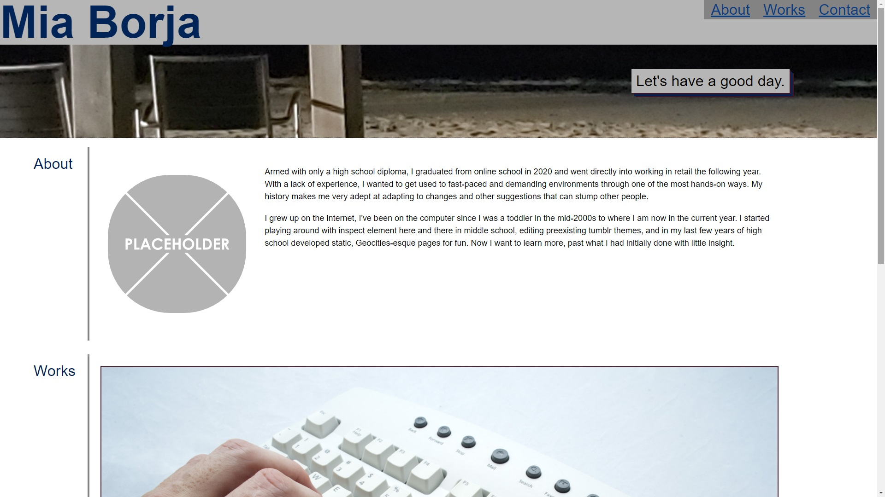

# My Portfolio

Our first experience for the second week coding a site from scratch, in particular this time being a portfolio that we can show our work through.

## About

[My Portfolio](https://pldbrja.github.io/mias-portfolio/)

Making this portfolio was much harder when trying to keep it to the general modern idea of what a portfolio would look like. It was a struggle, as I wanted to keep an aspect of it unique but without having it be too much of an annoyance to look at and browse through for grading. 

As a result of this, I had initially had a Y2K-esque one where I did not attempt to bend too many visual features. After getting around halfway through, I chose to drop it in order to pursue something that was a bit more put together. 

The repository where it was saved is still online, but I will not be submitting it.

## Note

Design isn't my strong suit at all, but my goal was to get all of the features desired in the user story. It may not have been through the correct methods for some areas, but in the end it would still work the way it is needed to even if it could be a bit unreliable.

The older code is archived and without a page, but the repository is linked below. Any images or other outside resources used in this page are linked in the Sources section.

## Links
* [Original Code](https://github.com/pldbrja/my-nice-portfolio)

### Sources
* [Placeholder Image](https://freesvg.org/graphic-placeholder)
* [Hands Typing Stock Image](https://www.freeimageslive.co.uk/free_stock_image/twohandtypingjpg)
* [Calculator Stock Image](https://www.stockvault.net/photo/194065/accounts)
* [Salad Stock Image](https://libreshot.com/fresh-salad/)
* [Black and White Cameras Stock Image](https://negativespace.co/collection-vintage-video-cameras/)
* [Javascript Code Stock Image](https://negativespace.co/wp-content/uploads/2017/08/negative-space-html-header-javascript-code-digital-buggu-thumb-1.jpg)